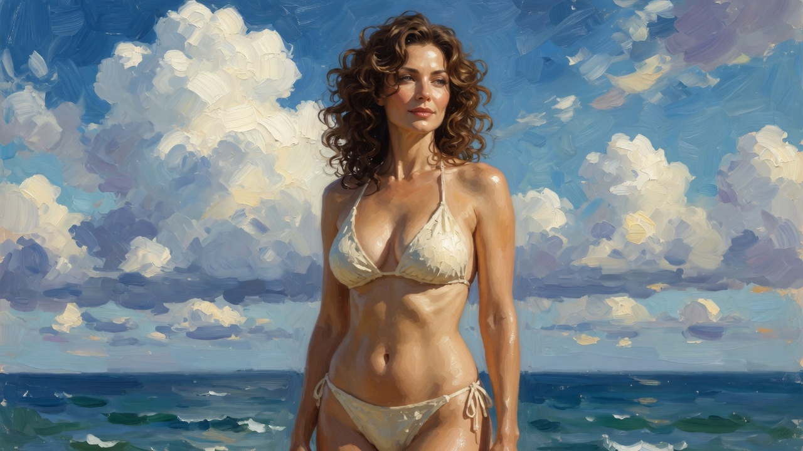
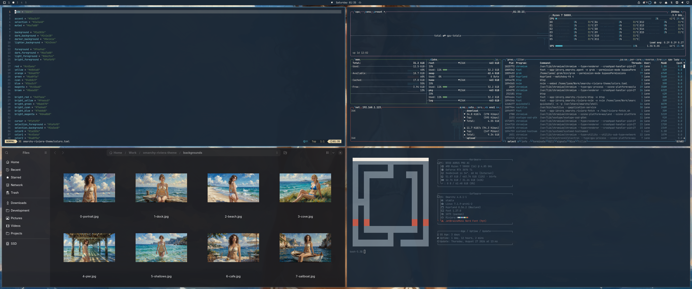

# Riviera

An Omarchy theme in sea blue, cream, and sunlit sand.

Deep navy UI, sky-blue accent, cream text. Wallpapers are impressionist oil paintings of adult women on the coast — cream and mint bikinis, wooden docks, coves, cafes, sailboats, golden hour.



Desktop with Neovim, btop, Files, and fastfetch:



## Install

```bash
omarchy theme install https://github.com/imcmurray/omarchy-riviera-theme
```

Or Omarchy menu → **Install → Style → Theme**, paste the repo URL.

Then pick a wallpaper with `Super + Ctrl + Space`.

## Palette

| Role | Hex |
| --- | --- |
| Background | `#1a2836` |
| Foreground | `#f4efe6` |
| Accent / sea | `#5ba3c9` |
| Sand | `#e8d4a8` |
| Foam cyan | `#4db8c9` |
| Selection | `#2a3a48` |

## Wallpapers

Cloud portrait, dock, beach walk, cliff cove, under the pier, shallows, cafe terrace, sailboat, rocks, towel, golden jetty, harbor, bicycle path.

Prefer **16:9** at **1920×1080** (or larger). Drop new JPGs in `backgrounds/`. Each wall is a new place and camera — not a contact sheet.

## Generating more wallpapers

Keep the first block the same every time. Only swap the **scene**.

**Base prompt**

> Full-bleed 16:9 desktop wallpaper, single figure, no contact sheet. Impressionist oil painting, visible brushstrokes, sunlight, blue sea, white clouds. A beautiful adult woman in her thirties, mature face, brown curly hair, cream bikini.

**Hard rules**

- Full-bleed scene — never a twelve-panel sheet
- Adult, thirties, not teen-faced
- New camera and place every image
- Sea `#5ba3c9`, cream `#f4efe6`, navy `#1a2836`
- 16:9, ideally 1920×1080 or larger

## License

MIT. Wallpapers are original illustrations created for this theme.
